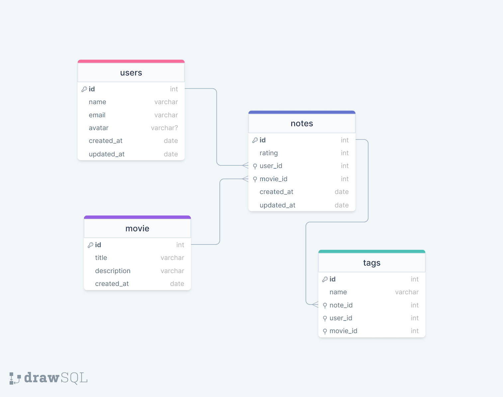

<h1 align="center"> Film Rating </h1>

  <a href="#-tecnologias">Tecnologias</a>&nbsp;&nbsp;&nbsp;|&nbsp;&nbsp;&nbsp;
  <a href="#-projeto">Projeto</a>&nbsp;&nbsp;&nbsp;|&nbsp;&nbsp;&nbsp;
  <a href="#-Diagram">Diagram</a>&nbsp;&nbsp;&nbsp;|&nbsp;&nbsp;&nbsp;
  <a href="#memo-licença">Licença</a>

  

 

  

## 🚀 Tecnologias

This project was developed with technologies:

- Node.JS
- Insomnia
- Git e Github

## 💻 Projeto

In this project the user will be able to rate the film and add tags

## 🔖 Diagram

You can view this diagram through [LINK](https://drawsql.app/teams/maresias/diagrams/film-registration).

## :memo: Licença

This project is under the MIT license.

---

